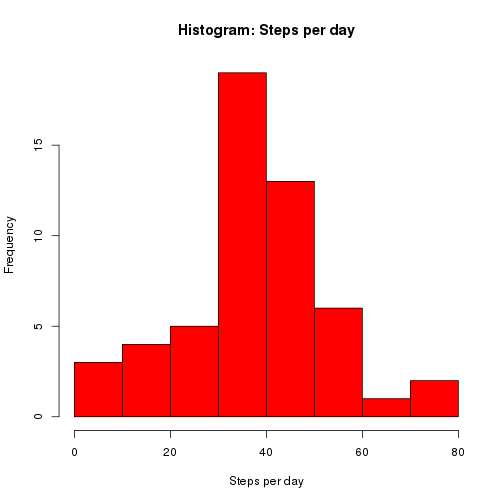
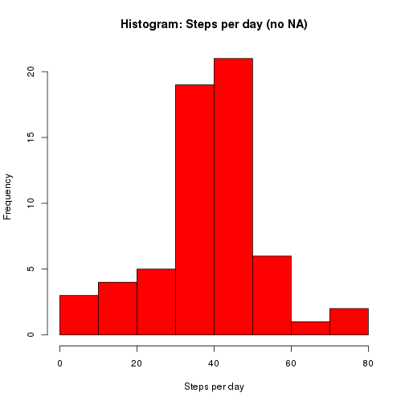

# Reproducible Research: Peer Assessment 1

Check and install all required packages.

```r
getPckg <- function(pckg) install.packages(pckg, repos = "http://cran.r-project.org")
pckg = try(require(knitr))
if (!pckg) {
    cat("Installing 'knitr' from CRAN\n")
    getPckg("knitr")
    require("knitr")
}
pckg = try(require(data.table))
```

```
## Loading required package: data.table
```

```r
if (!pckg) {
    cat("Installing 'data.table' from CRAN\n")
    getPckg("data.table")
    require("data.table")
}
pckg = try(require(xtable))
```

```
## Loading required package: xtable
```

```r
if (!pckg) {
    cat("Installing 'xtable' from CRAN\n")
    getPckg("xtable")
    require("xtable")
}
pckg = try(require(ggplot2))
```

```
## Loading required package: ggplot2
```

```r
if (!pckg) {
    cat("Installing 'ggplot' from CRAN\n")
    getPckg("ggplot2")
    require("ggplot2")
}
```

## Loading and preprocessing the data

> Show any code that is needed to
> 
> 1. Load the data (i.e. read.csv())
> 
> 2. Process/transform the data (if necessary) into a format suitable for your analysis

Unzip the compressed dataset and reformat the class of date-row to date.

```r
unzip(file.path(getwd(), "activity.zip"))
dt <- read.csv(file.path(getwd(), "activity.csv"))
dt <- data.table(dt)
dt$date <- as.Date(as.character(dt$date), format = "%Y-%m-%d")
```


## What is mean total number of steps taken per day?

> For this part of the assignment, you can ignore the missing values in the dataset.
> 
> 1. Make a histogram of the total number of steps taken each day


```r
dailymean <- aggregate(dt$steps, by = list(dt$date), FUN = mean, na.rm = TRUE)
names(dailymean) <- c("Date", "Mean")
hist(dailymean$Mean, xlab = "Steps per day", main = "Histogram: Steps per day", 
    col = "red")
```

 


> 2. Calculate and report the mean and median total number of steps taken per day


```r
dailymedian <- aggregate(dt$steps, by = list(dt$date), FUN = median, na.rm = TRUE)
names(dailymedian) <- c("Date", "Median")
print(xtable(cbind(as.character(dailymean$Date), dailymean$Mean, dailymedian$Median), 
    type = "html", include.rownames = FALSE))
```

% latex table generated in R 3.1.0 by xtable 1.7-3 package
% Mon May 12 13:13:05 2014
\begin{table}[ht]
\centering
\begin{tabular}{rlll}
  \hline
 & 1 & 2 & 3 \\ 
  \hline
1 & 2012-10-01 & NaN &  \\ 
  2 & 2012-10-02 & 0.4375 & 0 \\ 
  3 & 2012-10-03 & 39.4166666666667 & 0 \\ 
  4 & 2012-10-04 & 42.0694444444444 & 0 \\ 
  5 & 2012-10-05 & 46.1597222222222 & 0 \\ 
  6 & 2012-10-06 & 53.5416666666667 & 0 \\ 
  7 & 2012-10-07 & 38.2465277777778 & 0 \\ 
  8 & 2012-10-08 & NaN &  \\ 
  9 & 2012-10-09 & 44.4826388888889 & 0 \\ 
  10 & 2012-10-10 & 34.375 & 0 \\ 
  11 & 2012-10-11 & 35.7777777777778 & 0 \\ 
  12 & 2012-10-12 & 60.3541666666667 & 0 \\ 
  13 & 2012-10-13 & 43.1458333333333 & 0 \\ 
  14 & 2012-10-14 & 52.4236111111111 & 0 \\ 
  15 & 2012-10-15 & 35.2048611111111 & 0 \\ 
  16 & 2012-10-16 & 52.375 & 0 \\ 
  17 & 2012-10-17 & 46.7083333333333 & 0 \\ 
  18 & 2012-10-18 & 34.9166666666667 & 0 \\ 
  19 & 2012-10-19 & 41.0729166666667 & 0 \\ 
  20 & 2012-10-20 & 36.09375 & 0 \\ 
  21 & 2012-10-21 & 30.6284722222222 & 0 \\ 
  22 & 2012-10-22 & 46.7361111111111 & 0 \\ 
  23 & 2012-10-23 & 30.9652777777778 & 0 \\ 
  24 & 2012-10-24 & 29.0104166666667 & 0 \\ 
  25 & 2012-10-25 & 8.65277777777778 & 0 \\ 
  26 & 2012-10-26 & 23.5347222222222 & 0 \\ 
  27 & 2012-10-27 & 35.1354166666667 & 0 \\ 
  28 & 2012-10-28 & 39.7847222222222 & 0 \\ 
  29 & 2012-10-29 & 17.4236111111111 & 0 \\ 
  30 & 2012-10-30 & 34.09375 & 0 \\ 
  31 & 2012-10-31 & 53.5208333333333 & 0 \\ 
  32 & 2012-11-01 & NaN &  \\ 
  33 & 2012-11-02 & 36.8055555555556 & 0 \\ 
  34 & 2012-11-03 & 36.7048611111111 & 0 \\ 
  35 & 2012-11-04 & NaN &  \\ 
  36 & 2012-11-05 & 36.2465277777778 & 0 \\ 
  37 & 2012-11-06 & 28.9375 & 0 \\ 
  38 & 2012-11-07 & 44.7326388888889 & 0 \\ 
  39 & 2012-11-08 & 11.1770833333333 & 0 \\ 
  40 & 2012-11-09 & NaN &  \\ 
  41 & 2012-11-10 & NaN &  \\ 
  42 & 2012-11-11 & 43.7777777777778 & 0 \\ 
  43 & 2012-11-12 & 37.3784722222222 & 0 \\ 
  44 & 2012-11-13 & 25.4722222222222 & 0 \\ 
  45 & 2012-11-14 & NaN &  \\ 
  46 & 2012-11-15 & 0.142361111111111 & 0 \\ 
  47 & 2012-11-16 & 18.8923611111111 & 0 \\ 
  48 & 2012-11-17 & 49.7881944444444 & 0 \\ 
  49 & 2012-11-18 & 52.4652777777778 & 0 \\ 
  50 & 2012-11-19 & 30.6979166666667 & 0 \\ 
  51 & 2012-11-20 & 15.5277777777778 & 0 \\ 
  52 & 2012-11-21 & 44.3993055555556 & 0 \\ 
  53 & 2012-11-22 & 70.9270833333333 & 0 \\ 
  54 & 2012-11-23 & 73.5902777777778 & 0 \\ 
  55 & 2012-11-24 & 50.2708333333333 & 0 \\ 
  56 & 2012-11-25 & 41.0902777777778 & 0 \\ 
  57 & 2012-11-26 & 38.7569444444444 & 0 \\ 
  58 & 2012-11-27 & 47.3819444444444 & 0 \\ 
  59 & 2012-11-28 & 35.3576388888889 & 0 \\ 
  60 & 2012-11-29 & 24.46875 & 0 \\ 
  61 & 2012-11-30 & NaN &  \\ 
   \hline
\end{tabular}
\end{table}


## What is the average daily activity pattern?

> 1. Make a time series plot (i.e. type = "l") of the 5-minute interval (x-axis) and the average number of steps taken, averaged across all days (y-axis)


```r
intervalmean <- aggregate(dt$steps, by = list(dt$interval), FUN = mean, na.rm = TRUE)
```


```r
plot(x = 1:length(unique(dt$interval)), y = intervalmean$x, type = "l", ylab = "Steps", 
    xlab = "", xaxt = "n", main = "Averaged amount of steps taken in 24h")
axis(1, seq(0, 288, 24), seq(0, 288, 24) * 5/60)
```

 


> 2. Which 5-minute interval, on average across all the days in the dataset, contains the maximum number of steps?


```r
intervalmean$Group.1[which(intervalmean$x == max(intervalmean$x))]
```

[1] 835


## Imputing missing values
> Note that there are a number of days/intervals where there are missing values (coded as NA). The presence of missing days may introduce bias into some calculations or summaries of the data.

> 1. Calculate and report the total number of missing values in the dataset (i.e. the total number of rows with NAs)


```r
print(sum(is.na(dt$steps)))
```

[1] 2304


> 2. Devise a strategy for filling in all of the missing values in the dataset. The strategy does not need to be sophisticated. For example, you could use the mean/median for that day, or the mean for that 5-minute interval, etc.

The mean calculated in the previous task will be used to fill in the missing values.

> 3. Create a new dataset that is equal to the original dataset but with the missing data filled in.


```r
dt_noNA <- dt
for (i in 1:length(dt$interval[is.na(dt$steps)])) {
    if (length(intervalmean$x[dt$interval[is.na(dt$steps)][i]]) == 0) 
        dt_noNA$steps[is.na(dt$steps)][i] <- 0 else dt_noNA$steps[is.na(dt$steps)][i] <- intervalmean$x[dt$interval[is.na(dt$steps)][i]]
}
```


> 4. Make a histogram of the total number of steps taken each day and Calculate and report the mean and median total number of steps taken per day.


```r
dailymean_noNA <- aggregate(dt_noNA$steps, by = list(dt_noNA$date), FUN = mean, 
    na.rm = TRUE)
names(dailymean_noNA) <- c("Date", "Mean")
hist(dailymean_noNA$Mean, xlab = "Steps per day", main = "Histogram: Steps per day (no NA)", 
    col = "red")
```

 

```r

dailymedian_noNA <- aggregate(dt_noNA$steps, by = list(dt_noNA$date), FUN = median, 
    na.rm = TRUE)
names(dailymedian_noNA) <- c("Date", "Median")
print(xtable(cbind(as.character(dailymean_noNA$Date), dailymean_noNA$Mean, dailymedian_noNA$Median), 
    type = "html", include.rownames = FALSE))
```

% latex table generated in R 3.1.0 by xtable 1.7-3 package
% Mon May 12 13:13:11 2014
\begin{table}[ht]
\centering
\begin{tabular}{rlll}
  \hline
 & 1 & 2 & 3 \\ 
  \hline
1 & 2012-10-01 & 40.3170859538784 & 27.8679245283019 \\ 
  2 & 2012-10-02 & 0.4375 & 0 \\ 
  3 & 2012-10-03 & 39.4166666666667 & 0 \\ 
  4 & 2012-10-04 & 42.0694444444444 & 0 \\ 
  5 & 2012-10-05 & 46.1597222222222 & 0 \\ 
  6 & 2012-10-06 & 53.5416666666667 & 0 \\ 
  7 & 2012-10-07 & 38.2465277777778 & 0 \\ 
  8 & 2012-10-08 & 40.3170859538784 & 27.8679245283019 \\ 
  9 & 2012-10-09 & 44.4826388888889 & 0 \\ 
  10 & 2012-10-10 & 34.375 & 0 \\ 
  11 & 2012-10-11 & 35.7777777777778 & 0 \\ 
  12 & 2012-10-12 & 60.3541666666667 & 0 \\ 
  13 & 2012-10-13 & 43.1458333333333 & 0 \\ 
  14 & 2012-10-14 & 52.4236111111111 & 0 \\ 
  15 & 2012-10-15 & 35.2048611111111 & 0 \\ 
  16 & 2012-10-16 & 52.375 & 0 \\ 
  17 & 2012-10-17 & 46.7083333333333 & 0 \\ 
  18 & 2012-10-18 & 34.9166666666667 & 0 \\ 
  19 & 2012-10-19 & 41.0729166666667 & 0 \\ 
  20 & 2012-10-20 & 36.09375 & 0 \\ 
  21 & 2012-10-21 & 30.6284722222222 & 0 \\ 
  22 & 2012-10-22 & 46.7361111111111 & 0 \\ 
  23 & 2012-10-23 & 30.9652777777778 & 0 \\ 
  24 & 2012-10-24 & 29.0104166666667 & 0 \\ 
  25 & 2012-10-25 & 8.65277777777778 & 0 \\ 
  26 & 2012-10-26 & 23.5347222222222 & 0 \\ 
  27 & 2012-10-27 & 35.1354166666667 & 0 \\ 
  28 & 2012-10-28 & 39.7847222222222 & 0 \\ 
  29 & 2012-10-29 & 17.4236111111111 & 0 \\ 
  30 & 2012-10-30 & 34.09375 & 0 \\ 
  31 & 2012-10-31 & 53.5208333333333 & 0 \\ 
  32 & 2012-11-01 & 40.3170859538784 & 27.8679245283019 \\ 
  33 & 2012-11-02 & 36.8055555555556 & 0 \\ 
  34 & 2012-11-03 & 36.7048611111111 & 0 \\ 
  35 & 2012-11-04 & 40.3170859538784 & 27.8679245283019 \\ 
  36 & 2012-11-05 & 36.2465277777778 & 0 \\ 
  37 & 2012-11-06 & 28.9375 & 0 \\ 
  38 & 2012-11-07 & 44.7326388888889 & 0 \\ 
  39 & 2012-11-08 & 11.1770833333333 & 0 \\ 
  40 & 2012-11-09 & 40.3170859538784 & 27.8679245283019 \\ 
  41 & 2012-11-10 & 40.3170859538784 & 27.8679245283019 \\ 
  42 & 2012-11-11 & 43.7777777777778 & 0 \\ 
  43 & 2012-11-12 & 37.3784722222222 & 0 \\ 
  44 & 2012-11-13 & 25.4722222222222 & 0 \\ 
  45 & 2012-11-14 & 40.3170859538784 & 27.8679245283019 \\ 
  46 & 2012-11-15 & 0.142361111111111 & 0 \\ 
  47 & 2012-11-16 & 18.8923611111111 & 0 \\ 
  48 & 2012-11-17 & 49.7881944444444 & 0 \\ 
  49 & 2012-11-18 & 52.4652777777778 & 0 \\ 
  50 & 2012-11-19 & 30.6979166666667 & 0 \\ 
  51 & 2012-11-20 & 15.5277777777778 & 0 \\ 
  52 & 2012-11-21 & 44.3993055555556 & 0 \\ 
  53 & 2012-11-22 & 70.9270833333333 & 0 \\ 
  54 & 2012-11-23 & 73.5902777777778 & 0 \\ 
  55 & 2012-11-24 & 50.2708333333333 & 0 \\ 
  56 & 2012-11-25 & 41.0902777777778 & 0 \\ 
  57 & 2012-11-26 & 38.7569444444444 & 0 \\ 
  58 & 2012-11-27 & 47.3819444444444 & 0 \\ 
  59 & 2012-11-28 & 35.3576388888889 & 0 \\ 
  60 & 2012-11-29 & 24.46875 & 0 \\ 
  61 & 2012-11-30 & 40.3170859538784 & 27.8679245283019 \\ 
   \hline
\end{tabular}
\end{table}


> Do these values differ from the estimates from the first part of the assignment? 

Yes.

> What is the impact of imputing missing data on the estimates of the total daily number of steps?

As expected, the mean without missing values is increased as compared to the dataset containing missing values. The Median does not differ. Filling missing values has a certain impact of the data, whereas the filling strategy also has its influence. One should be carefully choose the right strategy and also think about, why there are missing values and wether they should be filled at all.


## Are there differences in activity patterns between weekdays and weekends?

> 1. Create a new factor variable in the dataset with two levels – “weekday” and “weekend” indicating whether a given date is a weekday or weekend day.


```r
tmp <- as.numeric(factor(weekdays(dt_noNA$date), levels = unique(weekdays(dt_noNA$date))))
tmp[tmp >= 6] <- "Weekend"
tmp[tmp < 6] <- "Weekday"
dt_noNA_weekdays <- cbind(dt, factor(tmp, levels = c("Weekday", "Weekend")))
names(dt_noNA_weekdays)[4] <- "Weekend"
```

```
## Warning: The names(x)<-value syntax copies the whole table. This is due to
## <- in R itself. Please change to setnames(x,old,new) which does not copy
## and is faster. See help('setnames'). You can safely ignore this warning if
## it is inconvenient to change right now. Setting options(warn=2) turns this
## warning into an error, so you can then use traceback() to find and change
## your names<- calls.
```


> 2. Make a panel plot containing a time series plot (i.e. type = "l") of the 5-minute interval (x-axis) and the average number of steps taken, averaged across all weekday days or weekend days (y-axis). The plot should look something like the following, which was creating using simulated data:


```r
intervalmean_noNA_weekdays <- aggregate(dt_noNA_weekdays$steps[dt_noNA_weekdays$Weekend == 
    "Weekday"], by = list(dt$interval[dt_noNA_weekdays$Weekend == "Weekday"]), 
    FUN = mean, na.rm = TRUE)
intervalmean_noNA_weekend <- aggregate(dt_noNA_weekdays$steps[dt_noNA_weekdays$Weekend == 
    "Weekend"], by = list(dt$interval[dt_noNA_weekdays$Weekend == "Weekend"]), 
    FUN = mean, na.rm = TRUE)
```


```r
layout(matrix(c(1, 2), 2, 1, byrow = TRUE))
plot(x = 1:length(unique(dt$interval)), y = intervalmean_noNA_weekdays$x, type = "l", 
    ylab = "Steps", xlab = "", xaxt = "n", main = "Averaged amount of steps taken in 24h [Weekdays]")
axis(1, seq(0, 288, 24), seq(0, 288, 24) * 5/60)
plot(x = 1:length(unique(dt$interval)), y = intervalmean_noNA_weekend$x, type = "l", 
    ylab = "Steps", xlab = "", xaxt = "n", main = "Averaged amount of steps taken in 24h [Weekend]")
axis(1, seq(0, 288, 24), seq(0, 288, 24) * 5/60)
```

 


